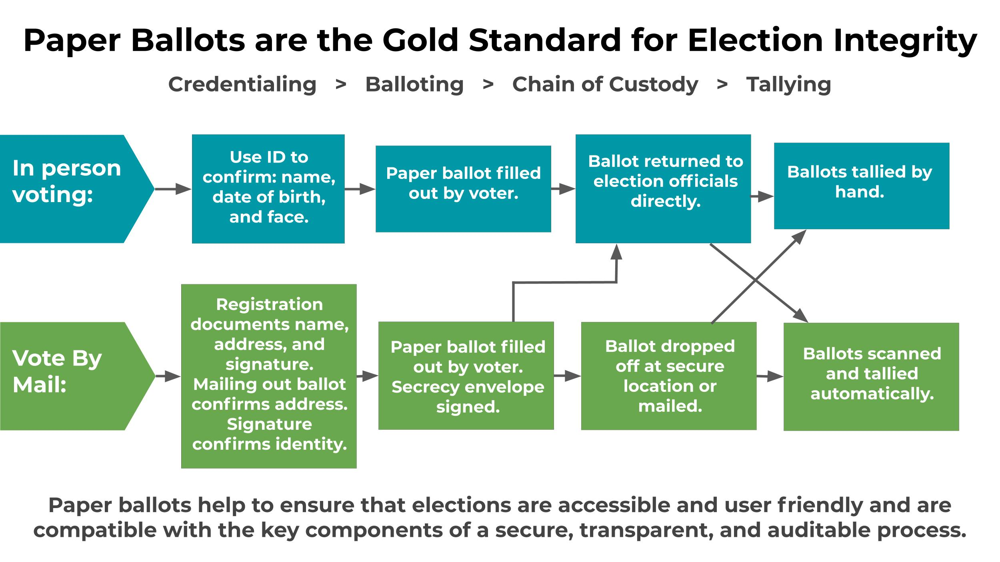
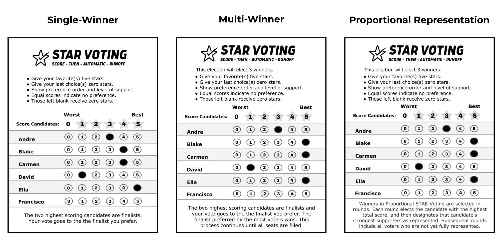

{:toc}

*STAR Voting paper ballots for the election of presidential delegates to the 2020 Democratic National Convention*

# Paper Ballots and STAR Voting
 
Paper ballots, either cast in person or via vote by mail, are the gold standard of election integrity for a number of reasons. End to end, paper ballots make elections simpler to host, less confusing for voters, more transparent, more secure, and easier to verify. It's a win-win. 

Most of the steps below are part of the process for running a secure election regardless if you are using STAR Voting or not, but we cover it all below so you have the information in context.

## Step 1: Plan your election
Use the chart above to plan out the flow of your election. You should have a plan for registration, credentialing, making your ballots, distributing your ballots, ensuring that your ballots and ballot data are not tampered with between the voting and tabulation stages, tallying your ballots, and finalizing your results. You should also consider making a plan for conducting a risk-limiting audit or recount if needed.

## Step 2: Identify your voters
Does your election have a finite number of possible voters? Do you know their identities? Is your election open to all who show up? Regardless, registering or credentialing your voters is key to ensuring that each individual is who they claim to be and ensuring that individuals only vote once.

Advanced registration or in-person credentialing at the time of your election are two good options for confirming voter identity.

## Step 3: Printing ballots

The type of ballots you'll use will depend on if you plan to conduct a hand count, or use a [scanner and OMR software](https://remarksoftware.com/products/office-omr/?gclid=Cj0KCQjwl4v4BRDaARIsAFjATPlmHe4OWR_4ALakiKBq9_o_kDCbGCRniVuT4VoX9QeBPJE0R93C_JQaAvNIEALw_wcB) to read the ballots for you. Regardless, make sure your ballots have clear and complete instructions explaining both how to vote and how STAR Voting is counted. If desired, include a spot for write-in candidates. Ballot text for single-winner, multi-winner bloc, and Proportional STAR Voting is as follows:

**Single-winner STAR Voting: Score - Then - Automatic - Runoff**

* Give your favorite candidate(s) five stars. Give your last choice(s) zero or leave blank. Score other candidates as desired. Equal scores indicate equal support.
* The two highest scoring candidates are finalists. Your full vote goes to the finalist you prefer. The finalist with the most votes wins.

**Bloc STAR Voting: Score - Then - Automatic - Runoffs.**

Bloc STAR Voting elects majority preferred winners for multi-winner elections.

* This election will elect X winners. Give your favorite five stars. Give your last choice zero or leave blank. Equal scores are allowed. Score other candidates as desired.
* The two highest scoring candidates are finalists. Your full vote goes to the finalist you prefer. The candidate with the most votes is elected. This process repeats with remaining candidates until all seats are filled.

**Proportional STAR Voting: Score - Then - Automatic - Runoffs.**

Propositional STAR ensures that 1/x of voters can win 1 out of the X seats available.

* This election will elect 3 winners. Give your favorite five stars. Give your last choice zero or leave blank. Score other candidates as desired. Equal scores indicate equal support.
* Winners in Proportional STAR are elected in rounds. Each round elects the candidate with the highest total score, then designates that candidate’s strongest supporters as represented. Subsequent rounds include all voters who are not yet fully represented.

Make sure that your ballots cannot be forged and that you have a system in place (such as including a voter ID, QR code, or barcode on each ballot) to confirm that each ballot corresponds to a specific voter.

If you plan to hand count, you can design your ballots any way you like. We have a few templates you're welcome to use [here](https://docs.google.com/presentation/d/1va-XEsUy0VI0jCTAHrQ_f9HNKex3VK9cm7WfF6jhUYM/edit?usp=sharing).

If you plan to use an OMR (Optical Mark Recognition) program to read your ballots you will need to design your ballots using the program to ensure that they are in the correct format for the software. Any survey program designed to read a 5 star rating will be able to read a 5 star ballot.

We recommend open sourced software, such as [Remark OMR™](https://remarksoftware.com/products/office-omr/) that doesn't require proprietary hardware so you will be able to use your own scanner if desired. Remark has a free trial option and great tech support. Just [download the software](https://remarksoftware.com/products/office-omr/try-remark-office-omr/) to your computer, design your ballot, and you are ready to start tallying ballots with all the bells and whistles of a professional election official. (See below for more information on Remark OMR™ for municipal elections.)

For a small one-off election it might not be worth the effort to set up OMR software, but if your election has over 100 voters, if you don't have people who want to help with hand counting, or if you run elections regularly it's worth it!

## Step 4: Tallying your ballots

All you'll need is a paper, pencil, and a calculator if you plan to tabulate manually. STAR Voting is counted in 2 rounds. In the scoring round, you add up the stars given to each candidate; in the runoff round, you add up the votes for each candidate. Simple [tally sheets](https://docs.google.com/presentation/d/1frvMhG3Gmw90WGpwzSyhKVNG9pNYyjTxeDZKBdf_ZgI/edit?usp=sharing%20) can make the process faster and more efficient and reliable.

If you use a scanner and OMR software, follow the OMR vendor instructions, scan your ballots, and then plug the totals for each candidate into our [Google Sheets Election Calculator](https://www.starvoting.us/star_with_google_sheets). Hit "Run Election" and you'll have your winner!

## A note on redundancy and election integrity:

As with anything, mistakes happen, so for election integrity it's key to have people working in teams so that any mistakes can be caught in real time and corrected before it's too late. Beyond mistakes, elections present additional concerns around fraud and tampering. Nobody wants to make a mistake while officiating an election. You don’t want to be suspected or accused of wrongdoing or be unable to prove your innocence. For this reason we recommend assigning at least two people to scrutinize, observe, and document every step of the process.

A good practice is to include representatives from each candidate as observers, and to ensure that your election officials are not all from one faction or party. Election officials and observers should always conduct themselves with professional, methodical, and non-partisan objectivity, but the reality is that nobody is neutral. An election should never rely on trust alone.

## Hand-count pro tips and independent observers:

For hand-counts, for the scoring round we recommend at least four people: a caller who reads off the scores on each ballot, a tallier who records the scores on the tally sheets, and two observers, one making sure that each score read is correctly and one ensuring that the person tallying doesn't fall behind or make an error.

STAR Voting is summable, which means that any subset of ballots can be tallied independently and the totals can be added together. Hand counts can be run quickly if needed by breaking volunteers into 3 person teams and giving each team a stack of ballots. Having each team in a separate room or far enough apart to provide some sonic space is a good idea.

For the runoff round, volunteers can break into teams of two. One person looks at each ballot to determine which finalist was preferred or whether the voter had no preference between those two, then sets each ballot in the corresponding pile. The other person watches to confirm that no mistakes are made. The three stacks of ballots are then counted to determine the winner.

[For more detailed information and tips on hand counting read this article.](https://www.starvoting.org/hand_count)

## Credentialing:

Credentialing voters involves confirming a few data points for identity verification. For example, confirming a voter's name, date of birth, and address via a photo ID is a great confirmation that people are who they claim to be. The number and types of data points you require and the documentation options you accept are up to you, but for securing important elections we recommend confirming at least two data points, or more if the election will not be held in person.

**Data points often used for credentialing**: name, date of birth, address, email, signature or password.

**Proof of identity documentation often used for credentialing**: Photo ID, medical or insurance documents, a post marked piece of mail, a signature or password which was filed in advance.

**Verifying data points**: If you have a photo ID of someone with their name on it, and the photo looks like them, you can confirm that the name on the ID is theirs.  People merely stating their address or email proves nothing, but if they repeat back to you a confirmation code you mailed them earlier, they have verified their address.

**Linking data points**: Once you have confirmed a person's name, you can use that data as an anchor  to validate other data points. For example a piece of mail with a name and an address could belong to anyone, but if you have already verified the name then the mail links the name to the address and you can consider both confirmed. Documents resulting from subsequent correspondence using that data are also corroborated.

**In person credentialing and voting**: Credentialing can be done in person at the time of the election easily. A voter's identity can be confirmed by looking at the person and looking at their photo ID. Once that is accomplished the other info on the ID is considered confirmed as well because the face and other data points are now linked. You can hand them their ballot and they are ready to vote.

**In person registration followed by remote voting**: If your election won’t be held in person, registering your voters in person in advance is recommended when possible. After confirming identity (as described above), one option is to have voters sign a registration card so you can match it to a required signature with the ballot later. Another option is to give each voter a Voter ID code or have them set up a password which they will provide with their ballot. Once voters have been registered, you simply send a ballot to their registered physical address or email address at the time of your election. The linked chain of previously validated registration data with transmission of the ballot and its return maintains a valid credentialing process throughout. 

**Remote registration and voting**: If you have a voter's name and email addresses confirmed in advance you can use an email instead of a physical address for credentialing. For example if a person sends you a photo of an insurance card with their name and date of birth over an email address which you have verified you can consider all those data points verified.

**Remote registration without advance registration**: If none of the options above are possible remote credentialing for high level security becomes much more difficult. In this case no data points are linked in advance and so you'll need to verify a voter's addresses and then use their address to verify other data points.

For example, if a person sends you a photo of a piece of postmarked mail with their address and name, then those data points are confirmed and linked. We don't recommend requesting a photo of an ID unless you can protect your voters personal identifying information against identity theft. Digital images of proof of identity documents must be stored very securely and deleted as soon as possible.

If you'd rather not request a lot of proof of identity documentation, an option may be to piggyback your election security on your state's voter registration process. Vote-by-Mail states like Oregon have voters show ID when they register to vote, and then confirm voters' addresses by the fact that the individual received their ballot. They then use the signature on the ballot to confirm that the correct person at that address voted.

For remote elections, voter identity can be confirmed by having voters input their registration info on a form, including name and date of birth, and then having your credentials team check the information against the public voter registration database. If the information comes up as correct in the voter file you have linked the data points and confirmed the voter's identity.

## On election security for elections without paper ballots:

While electronic elections can also achieve a high level of election security, in practice, doing so fully requires taking extra risks, and securing against those additional risks can bring up other ethical dilemmas, barriers to access, and logistical hurdles. Whenever possible we strongly recommend using paper ballots or at least ensuring that every voter receive a hard copy receipt which documents their vote and that elections officials keep a hard copy receipt of each ballot as well. 

## A note on Risk-Limiting-Audits and recounts:

Audits and recounts are an important part of election integrity best practices, but full recounts can be time consuming and expensive, depending on the election. [Risk limiting audits](https://en.wikipedia.org/wiki/Risk-limiting_audit) for STAR Voting are an accurate and reliable method for doing partial recounts as needed to confirm an election's validity.

Risk limiting audits, or (RLA)s, prescribe a number of ballots to be recounted depending on the margin of victory. If a race is won decisively, then an audit will look at a small fraction of ballots, but if the margin is smaller a larger recount is prescribed. If the RLA finds that the audit results are consistent with the reported election results, or if the margin of error is within expected limits, the election is certified. If the RLA result is inconsistent with the original tally, then another RLA is performed, this time with a larger sample of ballots.

Risk Limiting Audits for STAR Voting can be done using similar protocols used for plurality voting.

## Gravic/Remark OMR for Governmental Elections:

In the interest of providing estimates for STAR Voting implementation for jurisdictions where STAR Voting ballot initiatives are underway, we reached out to possible vendors to provide bids. For the city of Eugene, OR, which has a pupulation of 75k people, Gravic has provided a $21,530 [quote](https://www.starvoting.us/remark_quote) for using their [Remark OMR](https://remarksoftware.com/products/office-omr/) software. Lane County Elections (which runs elections for the City of Eugene,) currently uses 4 scanners and this quote is based upon maintaining that capacity. The quote includes four licenses at $4,030, a customer utility which would take the ballot data and calculate both STAR and binary election results for $15,000, as well as an optional $2,000-2,500 if the city would like Remark to draft the ballot design. If the city would like to design the ballots themselves Gravic would consult and then approve the final ballot design at no cost. In total, adopting Remark for Eugene or Lane County elections would represent $19,030 in fixed costs, plus certification. Adding in optional costs such as ballot design and software trainings, and 4 new scanners, Remark would still come in at under $22k.

Remark was used in a full scale pilot by the Democratic Party of Oregon to tabulate the STAR Voting paper ballots for the Presidential Delegate Elections and was selected as a top option by the Election Integrity Caucus research committee because it met all criteria for best practices, including open source software, independence from the internet, and other election security and user-interface criteria. Remark is compatible with modern scanners and computers and does not require proprietary hardware. 

## Cost Analysis:
More info on STAR Voting implementation costs and options for governmental elections can be found here:
STAR Voting Cost of Implementation
