You can run simple and functional STAR Voting polls quickly and easily on [BetterVoting.com](http://www.bettervoting.com/). More features are being added all the time.

If you are interested in running a more secure, credentialed, or professional election, Google Forms is the way to go. Both options are completely free.

To try out STAR Voting in Google Forms from a users perspective before you begin, you can cast a vote in the demo election from the tutorial below [here](https://forms.gle/xG91oePuZzV973uU6). 

# How to create a STAR Voting election on Google Forms

Google Forms can now run [single-winner STAR](http://starvoting.us/voting_guide) and multi-winner [Bloc STAR Voting](http://starvoting.us/multi_winner) elections off the shelf with the STAR Voting Elections add-on. If you are looking to tally a [Proportional STAR Voting](http://starvoting.us/pr) election you can use Google Forms for the balloting and email us for help with the tabulation at [elections@equal.vote](mailto:elections@equal.vote).

Images and instructions below are for users on a PC. If you are using a phone or tablet some things may appear differently. 

<iframe width="560" height="315" src="https://www.youtube.com/embed/lALJXzCWtGM?si=cIR48a-R_LM-ceUK" title="YouTube video player" frameborder="0" allow="accelerometer; autoplay; clipboard-write; encrypted-media; gyroscope; picture-in-picture; web-share" referrerpolicy="strict-origin-when-cross-origin" allowfullscreen></iframe>

## STEP 1: Create a new Google Form for your election:

* Go to Google Forms and click the plus sign at bottom right side of your page to create a new blank form. 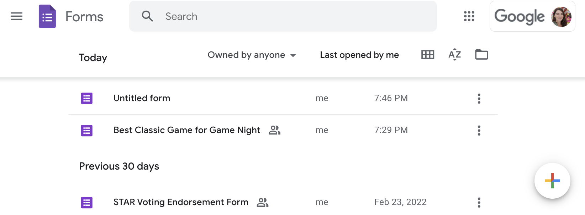

## STEP 2: Install the "STAR Voting Elections" Add-On and add it to your form:

* Go to the ... "more" menu at the top left corner of your screen and select "Add-Ons." 

* The Google Workspace Marketplace screen will open. Search for "STAR Voting Elections" and select. 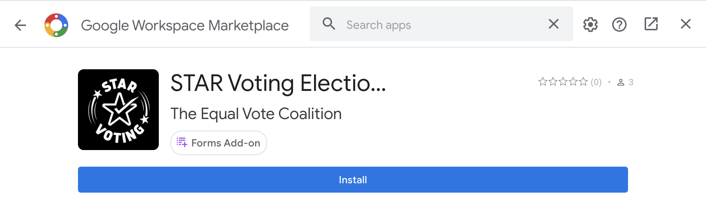

* Click the install button, click continue to grant the STAR Voting Elections add-on permission to run your election and create a spreadsheet for your election results, select the email account you want to use for the election, and then click "allow." The permissions granted allow STAR to create a spreadsheet for your results and put that in the correct folder. The add-on does not read or write to any other files on your drive. 

> STAR Elections and the full team at STAR Voting Action respect your privacy and we are committed to ensuring the security of the information you provide as well as the integrity of our elections in general. Read our [terms of service](https://www.starvoting.us/terms_of_service) and [privacy policy](https://www.starvoting.us/privacy_policy) here. All of our tools, including the STAR Elections Add-On, are [open sourced](https://www.starvoting.us/open_source) to facilitate third party security verification and testing. 

* Close Google Workspace Marketplace window by clicking the top left x in the corner to return to your form when your install is complete.  
 

## STEP 3: Customize your form:

* Name your form with the name of your election and add your election description. This is a good place to share details like when the election closes and when winners will be announced. If your election is multi-winner make sure to tell your voters how many winners there will be. 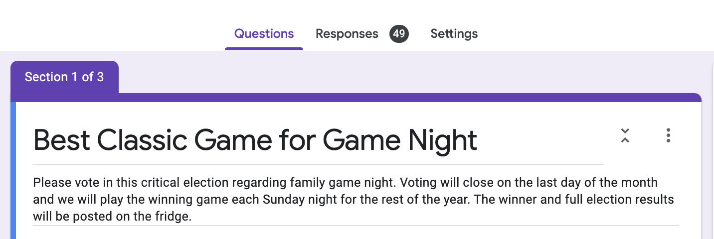

* Click "settings" at the top right. We recommend the settings below, but it's up to you. 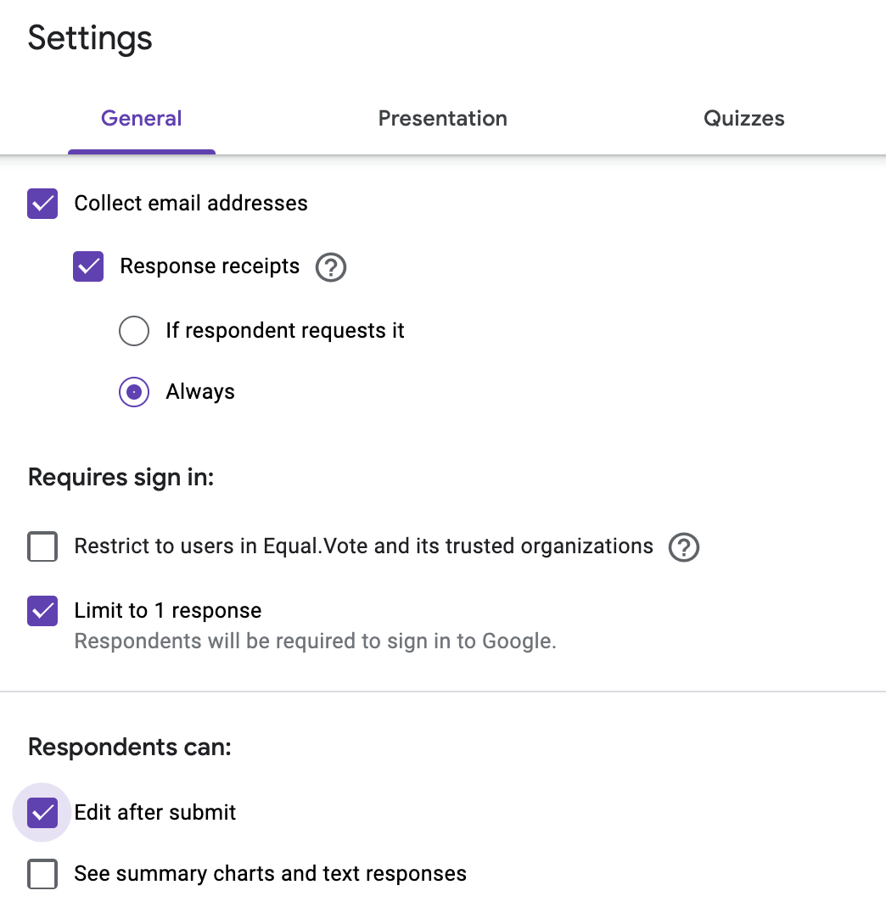

* Click over to the "Presentation" tab for other options like "shuffle question order."
* Click "save" when you're done with settings. 
* Your form comes with an "untitled question" section already at the top of your form. If you have other questions for your voters, besides the ballot itself add those here. Where it says "multiple choice" you can select other options such as "short answer." Many people use this section to ask for a name, phone number, or any info you may need for credentialing, such as a Verified Voter ID you may have given out to your voters in advance. 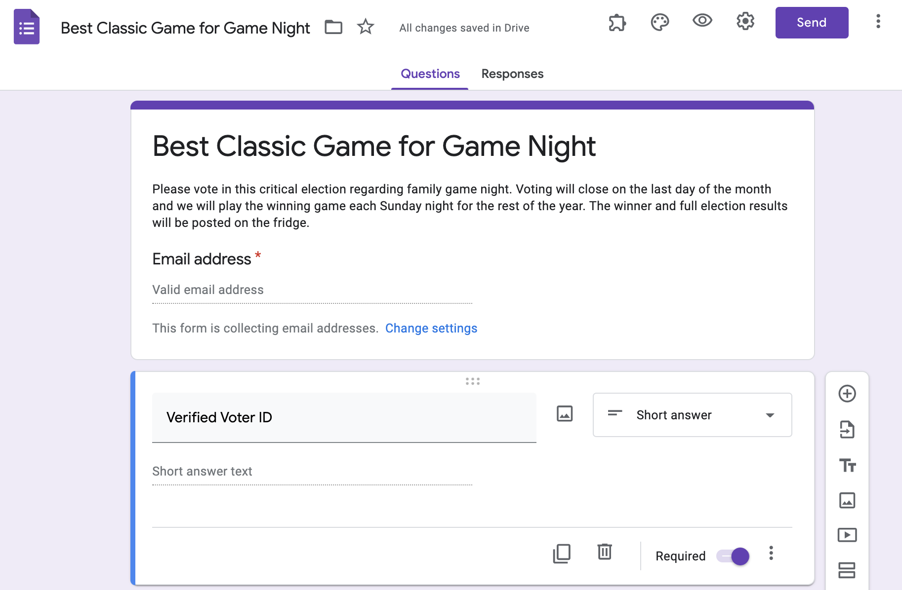

## STEP 4: Add Elections and Candidates:

* Click the "add-on" puzzle piece at the top of your screen again. Select "STAR Voting Elections," then "Add Election."

    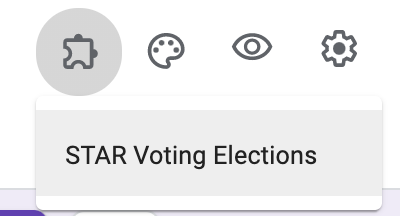
    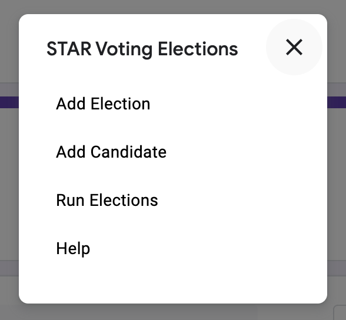

	
* Each election you add will appear as an additional section on your ballot and it will come with one candidate automatically. You can use the add-on puzzle piece to add elections or candidates as needed, or this can be done by copying the first election and candidate you created using the duplicate option at the bottom of the section. 

* Voter instructions should appear in the election description automatically. If they do not appear automatically, reload the page.

* Each election you create works for one race. If your form is tallying multiple races (ie. President, Secretary, Treasurer,) then you will want to add an election for each. 
 

## STEP 5: Add names, bios, and details:

* Name your races, add additional candidates if needed, and add candidate's names.

* Optional: The "Description" line below the name is a great place to add candidate bios or info like political party affiliation, relevant titles, or to link additional information like a candidate's website. You can also add an image for each candidate. If you don't see a space to add a candidate description when you click on the name line, the "show description" option may be under the ... "more" menu for the race. 

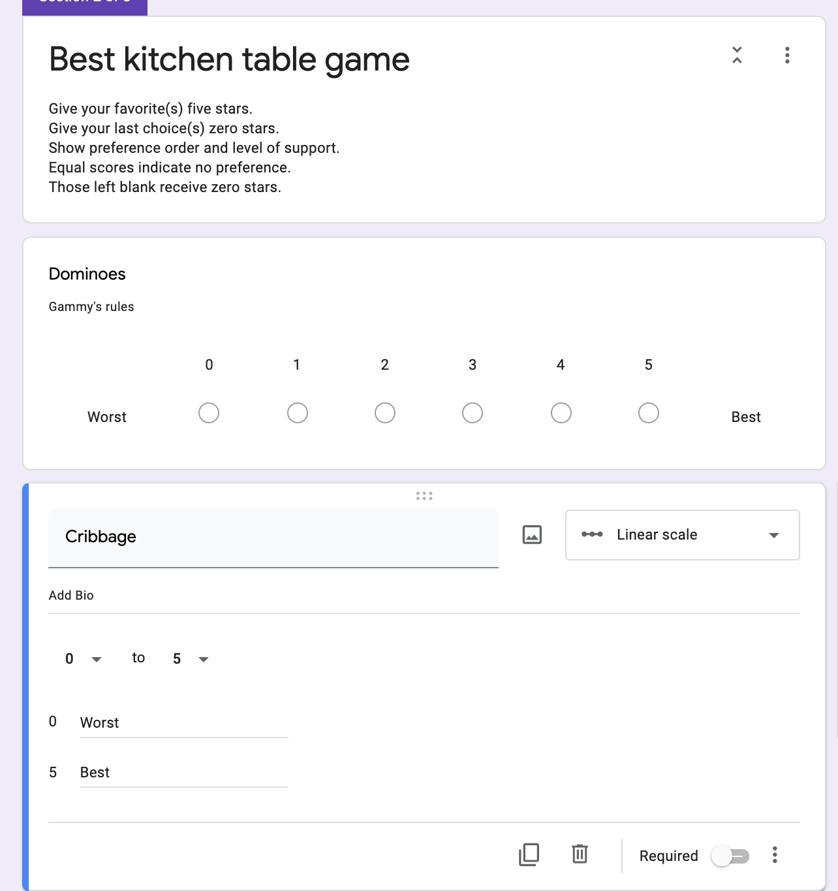

## STEP 6: Do a test run before sending out your ballots:
We always recommend sending yourself a ballot, casting a test vote, and taking a look at the election responses spreadsheet before you send out real ballots:

* When your ballot is all filled out as you want it, and your settings are dialed in, you're ready to send out a test ballot. 

* If you'd like to use your election description from section one as a message to your voters highlight it and copy it now.

* Click the "Send" button in the top right corner.

* Select "Send via email" and put in your own email address.

* Add in your message to voters if desired. Voters will receive an email with the message at the top followed by the election name and description that you put at the top of your form. (See below.)

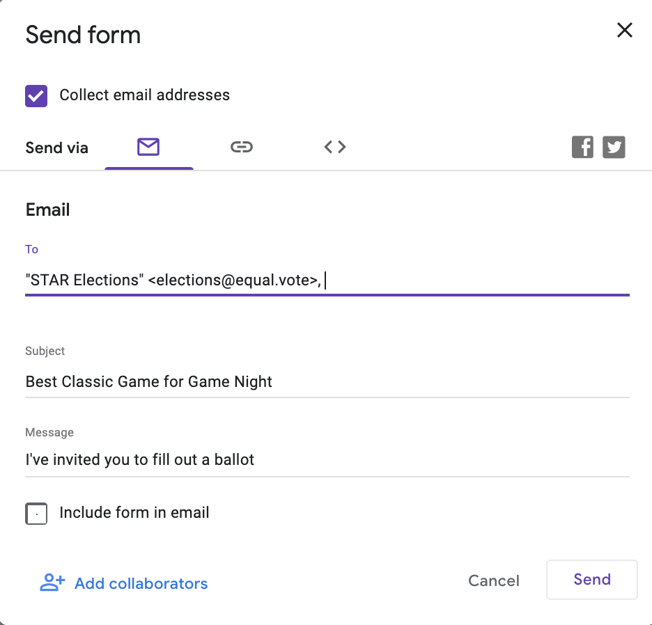

* If you wrote a custom message, copy and save the message text somewhere convenient so you won't have to retype it when you send out the ballots for real.
* Hit send.
* Go to your inbox, open the email, check that everything looks the way you want it to.

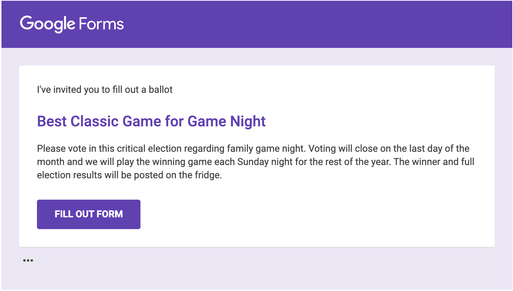

## STEP 7: (Optional) Cast a test vote:
Go back to your election. Once you've voted, your vote will be listed in the preliminary election results. If you aren't eligible to vote in the election you'll want to delete your test ballot before the election goes live:

* At the top of the page select "Responses." 

* This section will allow you to look at some election analytics on the summary page, look at responses by question, or look at the full ballot cast for each individual.
* Go to the ... "more" menu on this page, and click delete all responses. 
* To verify that your vote is gone, or to check on other votes cast, click on the green Google Sheets icon near the top right of the page.
* Name the spreadsheet where your responses will appear. By default it will have your election name, and then (Responses.) Click "create new spreadsheet," and then click "Create." Note that this is not the same as the spreadsheet where your election results will be tabulated, though it will contain the same votes as your final election. 
* Your Responses spreadsheet will automatically open in a new tab and can be found in your google drive under spreadsheets as well. 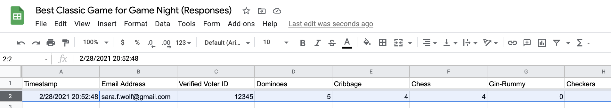

## STEP 8: Send out the real ballots!
**Note**: You can use email to send the ballots out to each eligible voter on your list, you can distribute a link to the ballot form, or you can even embed the election form into your website. If you'd like to vote in the demo election seen in this tutorial click [here](https://forms.gle/xG91oePuZzV973uU6)!

* Go back to the tab with your election itself and click the "Send" button in the top right corner.
* Paste your eligible voter email list in the "Email" section. 
* Select the options you prefer, and draft or paste in your message. 
* Hit "Send."
 

## STEP 8: Run the election
* At the top of the forms screen, click on the puzzle-piece icon again and click "run election."
* STAR Voting Elections creates a Google Sheet spreadsheet with the results of the election which can be found in your Google Forms drive folder. Unless you set up a custom name or location for your results, it will be named "Your Election's Name (Results)"
* Open the spreadsheet and see the results! If your election had multiple races, the first tab in your sheet will show the results of your full election. 
* For single-winner races your winner will be listed in 1st place!
* If a race is a multi-winner Bloc STAR election your winners will be the top candidates needed to fill the available seats. For a three winner race take the 1st, 2nd, and 3rd place winners. 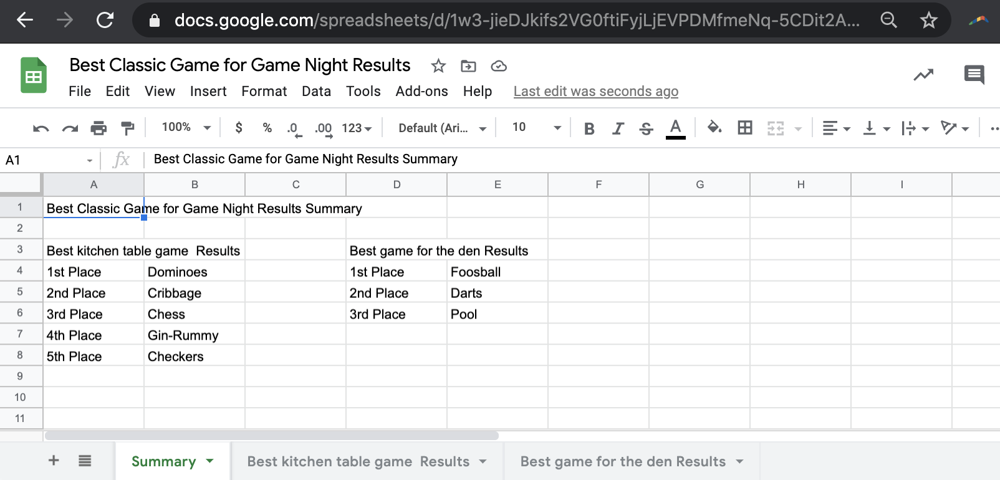

* The other tabs in your sheet will show results for each individual race. 
* Detailed results will show a preference matrix at the top, and then your election's results below. In the image below the matrix (cell 3E) shows that 5 voters preferred Dominos over Cribbage and only 2 voters preferred Cribbage over Dominoes (cell 4D.)
* For more information on reading a preference matrix or breaking ties in STAR Voting see our page on ties [here](https://www.starvoting.us/ties). 
* Ties in STAR Voting are much less common than in Choose-One Plurality or RCV elections, but they can happen, especially in small elections. If your election has a tie it will appear as a tie on your sheet and will not be broken for you. 

* If you would like your election tallied for proportional representation please send a copy of your responses and results spreadsheets to [elections@equal.vote](mailto:elections@equal.vote) and we can run the results for you. 

**Thank you for using STAR Voting on Google Forms! **
If you run into any issues or have suggestions please let us know at [elections@equal.vote](mailto:elections@equal.vote). If you have a good experience please leave us a great review! 