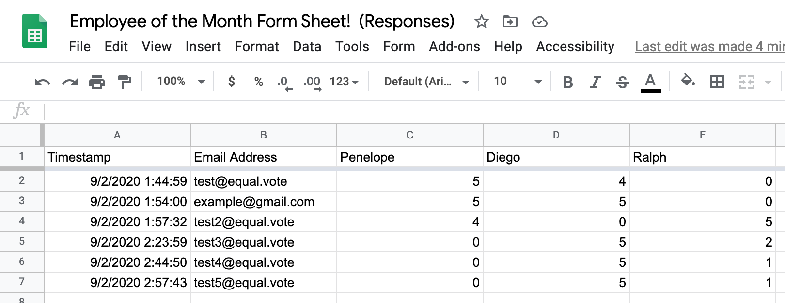
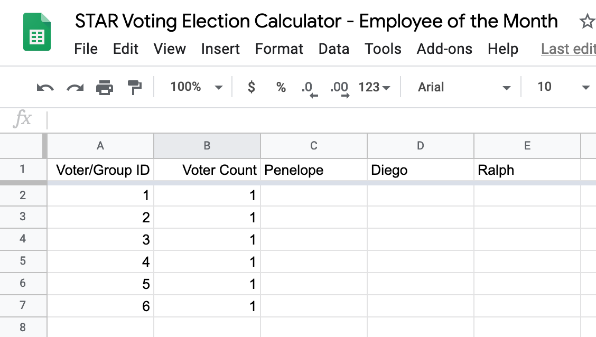
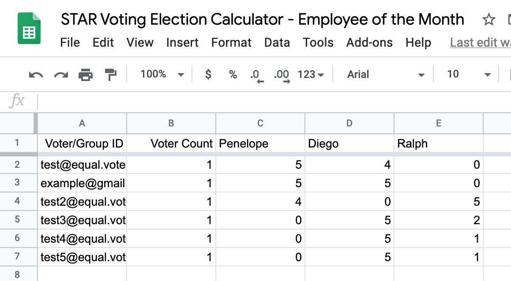
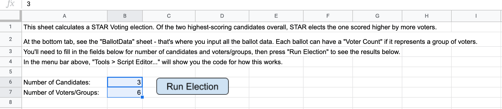
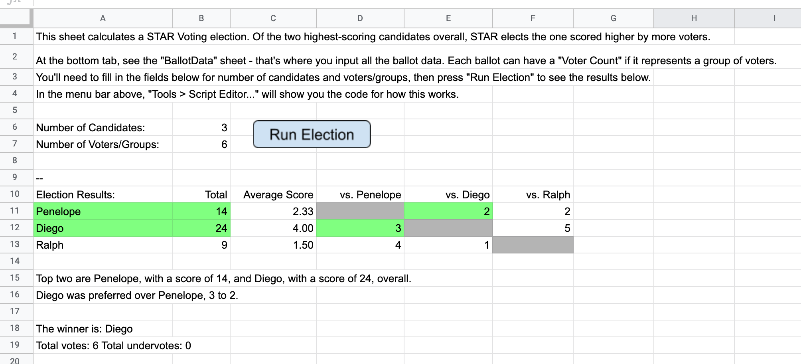

# STAR Voting on Google Sheets

There are a number of ways to host a STAR Voting election, either with [paper ballots](https://docs.google.com/presentation/d/1va-XEsUy0VI0jCTAHrQ_f9HNKex3VK9cm7WfF6jhUYM/edit?usp=sharing), with online tools like [Google Forms](https://www.starvoting.us/google_forms_beta), or with other voter interfaces like our [bettervoting.com](bettervoting.com) tool. STAR Voting is tallied using simple addition in both the scoring round and again in the automatic runoff, and a set of tally sheets is all that's needed to do a hand-count, but if your election is larger you may be looking for a tool that can automatically take your ballots, run the election, and tell you the winners.

With this in mind the STAR Elections team has developed [a google sheet that can be used to run a STAR Election](https://docs.google.com/spreadsheets/d/12Mh6nscdahbT2lkjWxKDQRTbJGMVeKpLyXFG-eon_ss/edit?usp=sharing). The sheet is open sourced for 3rd party verification of your election results if needed.

{: .highlight }
STAR Voting Action, STAR Elections, and the STAR Voting Google Forms add-on team take your privacy and security seriously. Read our [terms of service](https://www.starvoting.us/terms_of_service) and [privacy policy](https://www.starvoting.us/privacy_policy) here.
 
{: .note }
Note: Google regularly publishes updates and occasionally those updates have caused our sheet to raise an error. Errors in data formatting will also raise errors. If you have any problems at all running your election please email us at [elections@equal.vote](mailto:elections@equal.vote)

## Run your STAR Voting election on Google Sheets
 

### STEP 1: Send out your ballots and collect the votes.

**Balloting Options:**

* If you are using BetterVoting.com the site will take care of everything for you. You won't need this tutorial at all. BetterVoting.com is a great choice for many polls and some elections, and we are adding more features all the time.

* Make your own paper ballots, print them, collect them from your voters, and input the ballot data into a spreadsheet or csv file.

* Use software like Remark to create ballots that can then be scanned and read, automatically creating a csv file from your paper ballots. Remark is compatible with any digital scanner and they even offer a free trial membership which should allow you to run your first election at no cost.

* Use Google Forms to send out e-ballots to your voters. Under "Responses" click the green google sheets icon near the top right corner. This will open a google sheet with your ballot responses.  *A sample Google Forms election output*

With any of these options you will need your cast vote record in a spreadsheet in order to upload it to the STAR Election Calculator google sheet.

### STEP 2: Open and reset the Google Sheet

1. Open the STAR Elections Calculator - Template, go to "File", select "Make a Copy," and then name your new sheet to match your election. This will create a spreadsheet for your election specifically. You will be able to edit and share it as needed.
1. The Election Calculator sheet is already filled out with a sample election, so you can take a look at things, change a vote or two on the second tab, hit the run election button on the first tab, and get familiar with the sheet before you reset it and import your own ballot data.
1. In your new spreadsheet, click on the "BallotData" tab at the bottom of the screen.
1. Copy and paste in your candidate names starting in column C, D, and F. If you have more than 3 candidates continue adding them to the right of Candidate C. 
1. Delete the ballot data under the candidate names. Delete any extra candidates or voters.  *This example has 6 voters. We've input the candidates' names and deleted the vote data*

### STEP 3: Paste in your election and ballot data.

1. Copy the list of email addresses and paste them into the Election Calculator Sheet under "Voter/Group ID."
1. Copy the votes from your Google Forms Spreadsheet and paste them into the Election Calculator Sheet next to each voter ID.
1. Make sure the voter count is set to 1 for each voter unless you have a block of voters who all cast identical votes. If you have a voter block make sure to set the voter count to reflect the correct number of voters in that group.
1. Double check that the info is all correct.  *Here is the spreadsheet with the vote data and Voter IDs from our Google Forms election input.*

### STEP 4: Run Election
1. Click back to the "Results and Settings" tab.
1. Change the number of candidates and number of voters if needed.
1. Click "Run Election."  *This sheet is set to run an election with 3 candidates and 6 voters.*

1. You will be prompted to authorize the election and then to grant necessary permissions to "Score Runoff Voting calculator." Click "Continue" then "Allow."
1. The sheet will run your election and display the winners!  *Here are the election results:  Diego wins!*

{: .note-title}
> NOTE ON TIES
> 
> In the event that there is a tie in either the scoring round or the automatic runoff. This sheet will advance the first candidate, not the best candidate. It is not set up to break the tie fairly for you.
> **Ties should manually be broken in favor of the candidate who was either higher scoring overall or who was preferred by more voters.** For ties where both candidates received the same total scores and where neither was preferred over the other the election is truly tied.
> 
> Most organizations have a protocol for ties agreed upon and in writing before the election begins. We recommend going with a random tie breaker such as a public coin toss.
